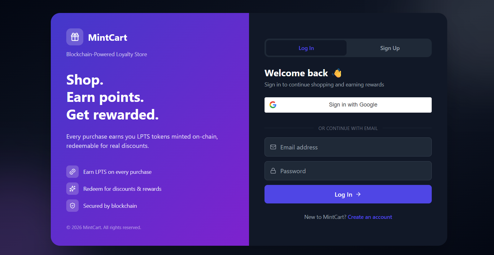
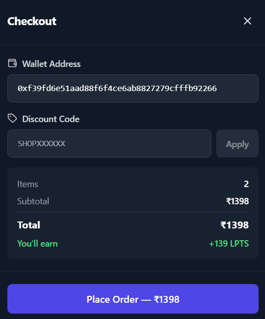
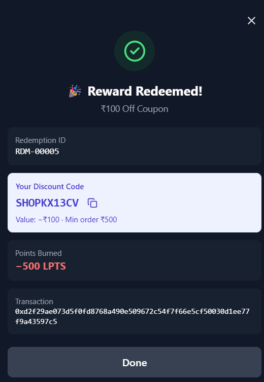
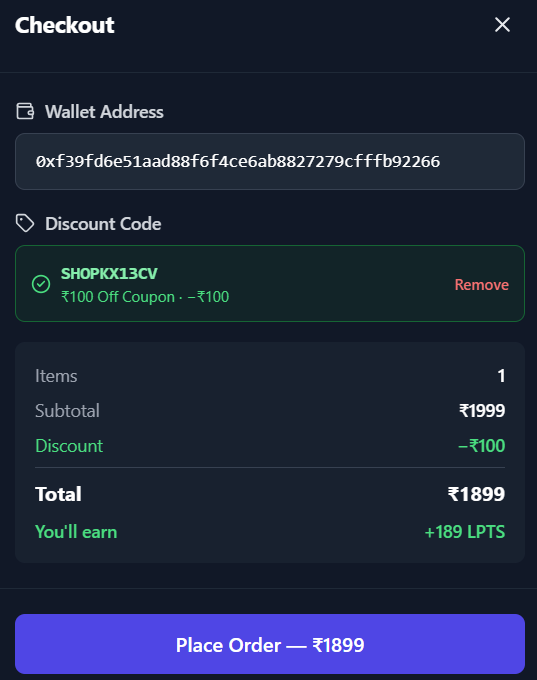
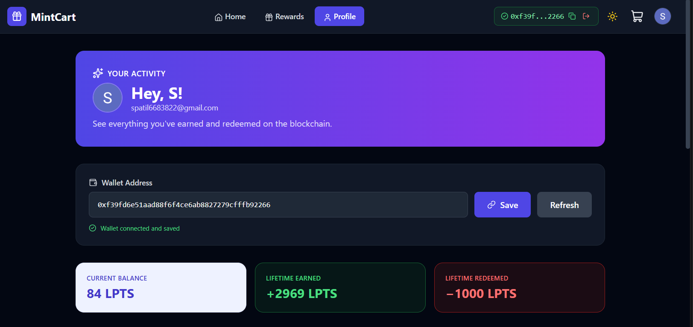

# MintCart — Blockchain-Powered Loyalty Store

A full-stack e-commerce application where users earn blockchain-based loyalty points (LPTS) on every purchase and redeem them for real discounts.

**Live Demo:** [https://mintcart-sage.vercel.app](https://mintcart-sage.vercel.app)

> **Important:** The blockchain layer (Hardhat) is **not deployed to a public network**. Points minting and reward redemption only work when running the project locally. See [Running Locally](#running-locally) for steps.

---

## Features

### E-Commerce
- 20+ products across 4 categories
- Product detail pages with images, features, and related items
- Shopping cart with quantity controls and animated drawer
- Checkout with wallet address auto-fill
- Discount code validation and one-time-use enforcement

### Blockchain
- **ERC-20 loyalty token (LPTS)** deployed via Solidity + Hardhat
- On-chain minting when users place orders
- On-chain burning when users redeem rewards
- Every transaction has a verifiable transaction hash
- OpenZeppelin security patterns (Ownable, access control)

### Rewards
- 6 reward types: coupons, free shipping, VIP membership
- Redeem points for one-time discount codes
- Automatic burn of LPTS on redemption

### Authentication
- **Google OAuth 2.0** (published, works for everyone)
- Email/password signup and login with bcrypt hashing
- JWT session tokens (30-day expiry)
- Per-user data isolation

### Data and UI
- MongoDB Atlas for users, orders, and redemptions
- Order and redemption history per user
- Dark mode toggle (persistent)
- Toast notifications with unique colors
- Framer Motion animations
- Fully responsive design

---

## Architecture

```
┌─────────────────────────────────────────────────────┐
│  REACT FRONTEND (Vercel)                            │
│  React + Vite + Tailwind + Zustand + Framer Motion  │
└──────────────┬──────────────────────────────────────┘
               │ HTTPS
               ▼
┌─────────────────────────────────────────────────────┐
│  EXPRESS BACKEND (Render)                           │
│  Node + Express + Mongoose + Ethers.js              │
│  JWT auth + Google OAuth verification               │
└──────────┬───────────────────┬──────────────────────┘
           │                   │
           ▼                   ▼
   ┌───────────────┐   ┌───────────────────┐
   │  HARDHAT      │   │  MONGODB ATLAS    │
   │  (localhost)  │   │  (cloud)          │
   │               │   │                   │
   │ LoyaltyToken  │   │ users             │
   │ LPTS token    │   │ orders            │
   │ On-chain      │   │ redemptions       │
   │ balances      │   │                   │
   └───────────────┘   └───────────────────┘
```

**Why a hybrid architecture?**

- The blockchain stores token ownership — verifiable, tamper-proof, user-owned
- MongoDB stores rich application data (order details, user profiles, timestamps) — fast, searchable, and doesn't expose private data publicly
- This is the standard pattern used by production Web3 apps (OpenSea, Uniswap, and others)

---

## Tech Stack

| Layer | Technology |
|---|---|
| Frontend | React 19, Vite, Tailwind CSS, Zustand, Framer Motion, React Router |
| Backend | Node.js, Express, Mongoose, Ethers.js, JWT, Bcrypt |
| Database | MongoDB Atlas |
| Blockchain | Solidity 0.8.24, Hardhat 3, OpenZeppelin |
| Auth | Google OAuth 2.0, JWT |
| Deployment | Vercel (frontend), Render (backend) |

---

## Screenshots

### Login


### Checkout


### Reward Redemption


### Reward Redemption — Discount Code


### Profile with History


---

## Blockchain Deployment Limitation

**The Hardhat blockchain is NOT deployed to a public testnet.**

The backend requires a running Hardhat node at `http://127.0.0.1:8545`. When deployed to Render, this URL points to the cloud server itself, where no Hardhat node exists — so on-chain operations fail with `ECONNREFUSED 127.0.0.1:8545`.

**What this means:**

- Login, signup, product browsing, and database operations work on the deployed site
- Placing orders, minting points, redeeming rewards, and MetaMask only work when running locally

**Why not deploy to Sepolia?**

Public testnet faucets (Alchemy, Chainlink, Google Cloud, QuickNode) now require proof-of-humanity — typically a Mainnet ETH or LINK balance — which isn't available for new developer wallets. This is a known ecosystem constraint in 2026. The full blockchain functionality is demonstrated locally.

---

## Running Locally

### Prerequisites

- Node.js v20 or later — [download](https://nodejs.org)
- MetaMask browser extension — [install](https://metamask.io/download)
- MongoDB Atlas account (free tier) — [sign up](https://www.mongodb.com/cloud/atlas/register)
- Google Cloud OAuth credentials — [console](https://console.cloud.google.com)

### Step 1: Clone the repository

```bash
git clone https://github.com/suyog365/mintcart.git
cd mintcart
```

### Step 2: Set up the Contracts folder

```bash
cd contracts
npm install
```

Create `contracts/.env`:

```env
SEPOLIA_RPC_URL=https://eth-sepolia.g.alchemy.com/v2/YOUR_KEY
SEPOLIA_PRIVATE_KEY=0xac0974bec39a17e36ba4a6b4d238ff944bacb478cbed5efcae784d7bf4f2ff80
```

### Step 3: Start the local blockchain

In **Terminal 1**:

```bash
cd contracts
npx hardhat node
```

Wait for 20 test accounts to appear. Leave this terminal running.

### Step 4: Deploy the contract

In **Terminal 2**:

```bash
cd contracts
npx hardhat run scripts/deploy.ts --network localhost
```

Copy the contract address from the output.

### Step 5: Set up the Backend

```bash
cd backend
npm install
```

Create `backend/.env`:

```env
PORT=5000
RPC_URL=http://127.0.0.1:8545
BACKEND_PRIVATE_KEY=0xac0974bec39a17e36ba4a6b4d238ff944bacb478cbed5efcae784d7bf4f2ff80
CONTRACT_ADDRESS=<paste-your-contract-address-here>
MONGO_URI=<your-mongodb-atlas-connection-string>
GOOGLE_CLIENT_ID=<your-google-oauth-client-id>
JWT_SECRET=<any-long-random-string>
```

Start the backend:

```bash
node server.js
```

### Step 6: Set up the Frontend

In a new terminal:

```bash
cd frontend
npm install
```

Create `frontend/.env`:

```env
VITE_GOOGLE_CLIENT_ID=<your-google-oauth-client-id>
VITE_API_URL=http://localhost:5000
```

Start the frontend:

```bash
npm run dev
```

Open **http://localhost:5173** in Chrome.

### Step 7: Configure MetaMask

1. Install the MetaMask browser extension
2. Add network:
   - Network name: **Hardhat Local**
   - RPC URL: **http://127.0.0.1:8545**
   - Chain ID: **31337**
   - Symbol: **ETH**
3. Import test account:
   - Private key: `0xac0974bec39a17e36ba4a6b4d238ff944bacb478cbed5efcae784d7bf4f2ff80`
   - This gives you 10,000 test ETH

### Step 8: Use the app

1. Sign in with Google or email
2. Connect your MetaMask wallet
3. Browse products and place an order — LPTS minted on-chain
4. Go to Rewards, redeem a reward — LPTS burned on-chain
5. Check your Profile — see order and redemption history

---

## Project Structure

```
mintcart/
├── frontend/                # React app
├── backend/                 # Express API
├── contracts/               # Hardhat project
├── screenshots/             # UI screenshots
└── README.md
```

---

## Smart Contract

**LoyaltyToken.sol** — an ERC-20 token with:

- `awardPoints(address user, uint256 amount)` — backend mints LPTS to a user
- `adminRedeem(address user, uint256 amount)` — backend burns LPTS on redemption
- `redeemPoints(uint256 amount)` — user-initiated burn
- `setMinter(address, bool)` — owner controls who can mint

Built with OpenZeppelin's `ERC20` and `Ownable` contracts.

---

## Project Highlights

- Full MERN stack with blockchain integration
- Production deployment on Vercel + Render + MongoDB Atlas
- Google OAuth 2.0 published app
- Per-user data isolation
- Real on-chain transactions (mint and burn)
- Hybrid architecture (off-chain data and on-chain ownership)
- Sensitive keys kept server-side only

---

## Author

**Suyog Patil**

- GitHub: [@suyog365](https://github.com/suyog365)
- Email: patilsuyog2871@gmail.com
